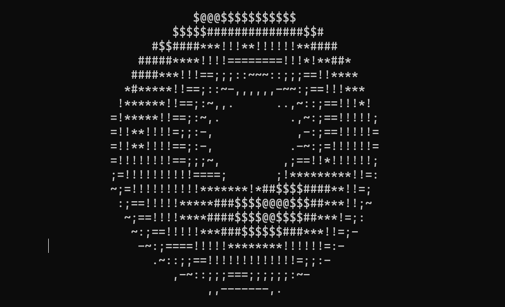

# 3D donut in terminal - with CUDA



`dotnut.c` is an ascii-art from [a1k0n](https://www.a1k0n.net/2011/07/20/donut-math.html) which can be originated back to 2006. 

However, the author did a lot to optimize the code length and performance, making the code less readable. So I rewrote the code without optmization and added annotation.

Recently, I started to get interested in CUDA programming. Then I realized the donut on GPU with CUDA.

## Usage

> [donut_nocuda.cpp](./no-cuda/donut_nocuda.cpp) is the normal donut code, but more readable.  
> [donut_cuda.cu](./cuda/donut_cuda.cu) is the CUDA accelerated version.

### no-cuda version

```shell
#macOs
no-coda % clang++ donut_nocuda.cpp -o donut
no-coda % ./donut
```
```shell
#Windows with mingw
no-cuda> gcc donut_nocuda.cpp -o donut
no-cuda> ./donut.exe
```

### cuda version
CUDA acceleration requires compatible Nvidia GPU and CUDA runtime.

```shell
#Windows 
cuda> nvcc ./donut_cuda.cu -o donut
cuda> ./donut.exe
```
---
Enjoy the donut!